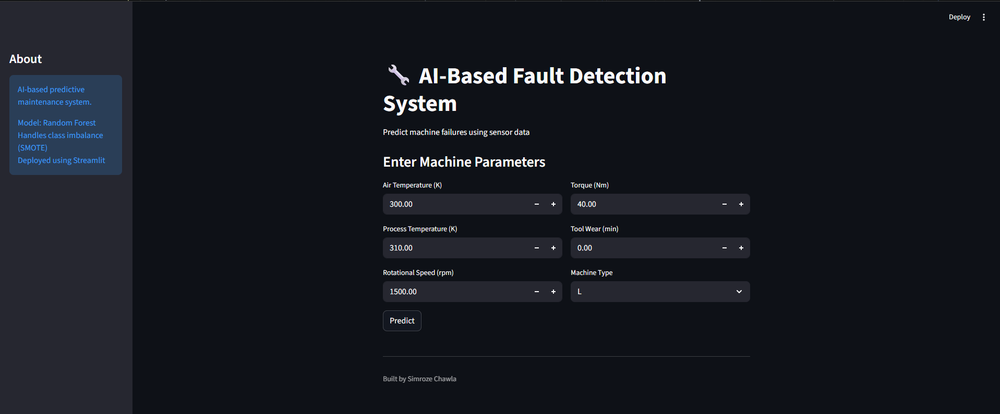
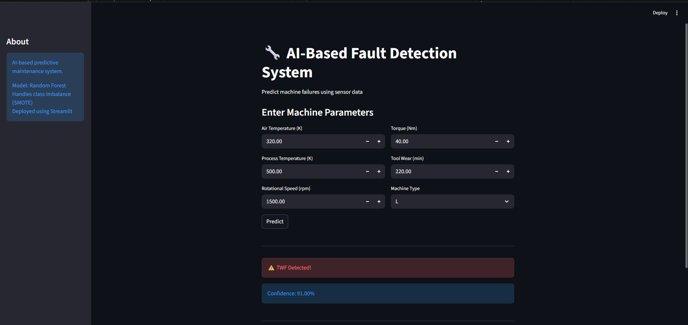

# AI-Based Fault Detection System

An end-to-end Machine Learning project that predicts machine failures using sensor data.

## Features

* Predicts machine failure in real-time
* Handles class imbalance using SMOTE
* Streamlit-based interactive UI
* Trained using Random Forest Classifier

## Model Details

* Algorithm: Random Forest
* Dataset: AI4I 2020 Predictive Maintenance Dataset
* Features:

  * Air Temperature
  * Process Temperature
  * Rotational Speed
  * Torque
  * Tool Wear
  * Machine Type (L, M, H)

## Output

* Predicts:

  * No Failure
  * Failure Detected
* Displays confidence score

## 📸 Demo

### 🔹 Input Interface


### 🔹 Prediction Output


## 🖥️ Run Locally

```bash
git clone https://github.com/Simrozechawla/fault-detection-ai.git
cd fault-detection-ai
pip install -r requirements.txt
python -m streamlit run app/streamlit_app.py
```

## Project Highlights

* Solves real-world predictive maintenance problem
* Handles imbalanced dataset
* End-to-end ML pipeline + deployment

## 👨‍💻 Author

Simroze Chawla
